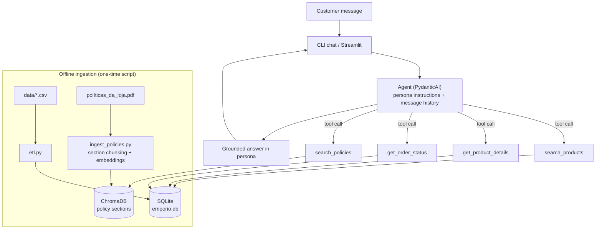

# Architecture

Rationale for every choice here: `docs/decisions.md` (ADR-001…009).

## Flow



Off-topic questions trigger no tool — the persona prompt instructs a polite in-persona redirect.

## Tools

| Tool | Signature (typed params) | Backs | Notes |
|---|---|---|---|
| `search_products` | `(query: str \| None, category: str \| None, max_price: float \| None, min_price: float \| None) -> list[ProductSummary]` | SQLite | Parameterized SQL; joins active promotions → returns effective price; only `status='active'` |
| `get_product_details` | `(product_name: str) -> ProductDetails \| NotFound` | SQLite | Name normalization (lowercase, strip hyphens/spaces) so "GD20" matches "GD-20"; returns specs, stock, price w/ promo |
| `get_order_status` | `(customer_phone_or_email: str, order_id: int \| None = None) -> list[OrderStatus] \| AuthError` | SQLite | Customers rarely know order ids: identifier alone lists that customer's orders; with id, returns full detail. **Privacy guardrail in code**: identifier must match the order's customer; never leaks other customers. Response joins `order_items` → product names, includes `tracking_code`, `estimated_delivery`, `notes` |
| `search_policies` | `(question: str) -> list[PolicyChunk]` | ChromaDB | Top-k (k≈3) section chunks with section titles; agent cites the rule |

Design rules:

- Tools return structured data (Pydantic models) — the agent phrases the answer, never invents values.
- All SQL is parameterized; no free-form query tool exists (ADR-003).
- Tool descriptions are the routing layer (ADR-001): each description states precisely when to use it.

## Project layout (planned)

```
emporio_agent/
├── pyproject.toml            # uv-managed
├── README.md
├── .env.example              # OPENAI_API_KEY, MODEL, EMBEDDING_MODEL, REFERENCE_DATE
├── CLAUDE.md
├── docs/                     # this documentation
├── data/                     # provided CSVs + policy PDF (source of truth)
├── examples/                 # 3–5 conversation transcripts (.md)
├── src/emporio/
│   ├── etl.py                # CSVs → SQLite (normalize specs JSON, validate)
│   ├── ingest_policies.py    # PDF → section chunks → embeddings → ChromaDB
│   ├── db.py                 # SQLite connection + query helpers
│   ├── retrieval.py          # policy search
│   ├── tools.py              # the 4 typed tools
│   ├── agent.py              # PydanticAI agent + persona prompt
│   ├── persona.py            # agent instructions (PT-BR)
│   ├── cli.py                # chat loop (rich), streaming, transcript export
│   └── api.py                # FastAPI: POST /api/chat (SSE) + serves web/dist (ADR-010)
├── app.py                    # Streamlit chat: streaming + tool-call visibility (expander per response)
├── web/                      # React + TS + Tailwind chat (Vite); dist/ committed
│   ├── src/                  # App, ChatMessage, ToolCallBadge, useChatStream hook
│   └── dist/                 # production build served by FastAPI (no Node needed to run)
└── tests/
    ├── test_etl.py
    ├── test_tools.py         # incl. privacy guardrail cases
    ├── test_retrieval.py
    ├── test_api.py           # SSE endpoint contract
    └── test_behavior_live.py # golden scenarios vs real model (pytest -m live, ADR-011)
```

## Prompt / persona strategy

- **Persona (PT-BR)**: friendly, musically knowledgeable attendant of Empório da Música. Grounded in policy §7
  ("Diretrizes de Atendimento" — the store's own official tone guide) + §1 (store identity, founded 2008,
  Campo Grande/MS, instruments only).
- **Grounding rule**: prices, stock, order info, and policy rules must come from tool results. If a tool returns
  nothing, say so honestly — never guess.
- **Scope rule**: off-topic → polite redirect without answering the content; accessory questions → explain the
  store sells instruments only. The accessory list (strings, picks, cables, cases, pedals, amps) is stated in the
  instructions: live testing showed the model otherwise matched "cordas de violão" against "7-string" guitars in
  the catalog and answered as if the store sold strings.
- **Identification flow**: order-status requests without phone/e-mail → ask for an identifier before calling the tool
  (order id optional — identifier alone lists the customer's orders).
- **Date awareness**: "today" is injected into the runtime instructions at session start (ADR-009). Defaults to the real
  date; `REFERENCE_DATE` env var overrides it for demos, since the dataset's orders span 2025-10 → 2026-03 and
  date-relative rules (7-day right of regret) would otherwise always evaluate as expired.
- **Receipt-date assumption**: the dataset has no `delivered_at` field. For delivered orders, the prototype treats
  `estimated_delivery` as the receipt date when applying date-relative policies and states that assumption in the
  answer. The in-window demo uses order 7 with `REFERENCE_DATE=2026-02-20` (three days after its estimated delivery).

## Data treatment notes

- `products.specs` is embedded JSON → normalized into queryable columns (or kept as JSON1-queried column) during ETL.
- Effective price = `price_brl × (1 − discount_percent/100)` only when `promotions.is_active = 1`.
- `orders.status` values (delivered, shipped, processing…) mapped to PT-BR customer-facing labels in the tool response.
- Only `status='active'` products are offered to customers.
- Prices formatted PT-BR style in responses (R$ 1.234,56).
- Generated artifacts (`emporio.db`, `chroma/`) are **gitignored** and rebuilt by the ingestion scripts — fresh
  clone must work with one setup command.

## Interfaces

Three thin layers over the same `agent.py` core (`run_turn` + its `on_text`/`on_tool_call` callbacks):

- **CLI** (`cli.py`): primary dev interface; streams all agent and tool events with `run_stream_events`; exports
  session transcripts to `.md` (doubles as the example-conversation deliverable).
- **Streamlit** (`app.py`): zero-friction chat. Streams responses and renders an expander per answer showing
  which tools were called and with what arguments (🔧 catalog / 📦 orders / 📖 policies). This makes the agent's
  routing — "knows when to query data vs policies", an explicitly evaluated behavior — directly observable.
- **FastAPI + React** (`src/emporio/api.py` + `web/`, ADR-010): `POST /api/chat` streams Server-Sent Events —
  `tool_call` (name + args, emitted when the call happens), `text` (answer deltas), `done` (turn complete).
  History kept in memory per `session_id`. FastAPI also serves the committed React build (`web/dist/`), so the
  evaluator runs `uv run emporio-api` and opens a browser — Node.js is only needed to modify the front-end
  (React + TypeScript + Tailwind via Vite; no router/state library — one page, one SSE hook).

## Behavior evals (ADR-011)

`tests/test_behavior_live.py` — golden scenarios against the real model asserting tool routing and key facts
(price, refusals, privacy guardrail). Marked `live`, excluded from the default suite; `uv run pytest -m live`
runs them with an `OPENAI_API_KEY`. Encodes the manual live-review findings (accessories trap, policy-first
answers, off-topic redirect) as permanent regression tests.
